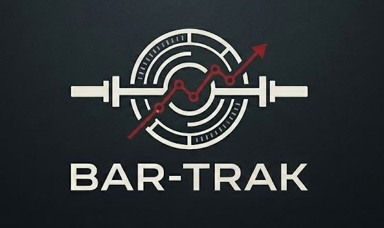
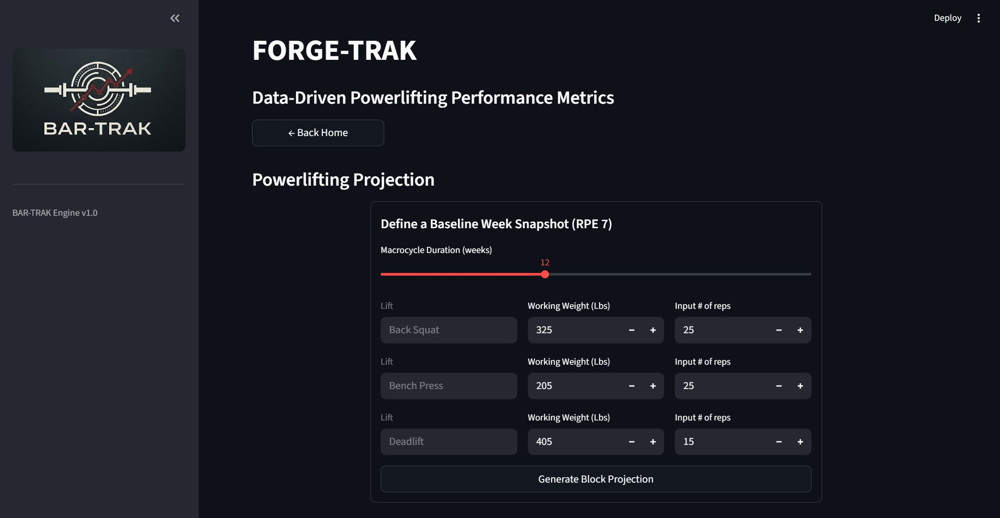
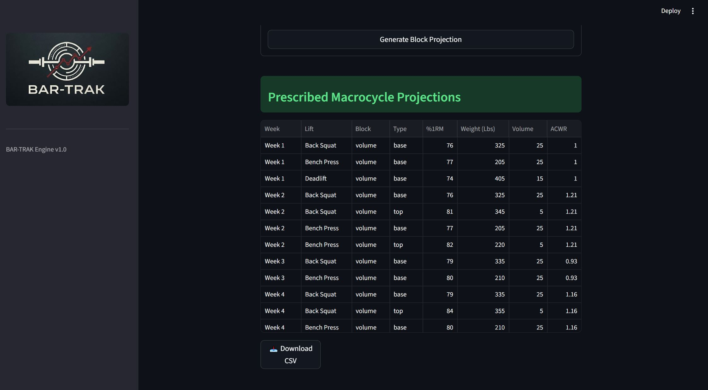

# BAR-TRAK 

<p align="center">
  
</p>

## Data-driven powerlifting performance metrics 
`bar-trak` is a Python-based computational engine and interactive Streamlit dashboard designed for lifters and coaches. 
The application streamlines training tracking by conducting block periodization analytics, managing volume distribution, and computing autoregulated load projections based on recent performance metrics.

**[🚀 Live Interactive App: https://eulerlft-bar-trak.streamlit.app/](https://eulerlft-bar-trak.streamlit.app/)**

--- 

## Core Features 

* **Block Periodization Analytics:** Examine historical training trends, tracking changes in volume, average intensity and fatigue accumulation across distinct micro cycles.
* **Relational Storage Layout:** Leverages a structured local SQLite database to maintain queryable lifting logs and configurations, eliminating reliance on flat tracking sheets. 
* **Fatigue & Workload Monitoring:** Computes real-time workload stress variables and best-fit regression lines to ensure lifters scale training metrics effectively while preventing overtraining.
* **Deterministic Program Development:** Generates comprehensive multi-week training schedules built directly from an initial performance baseline, transitioning smoothly from accumulation blocks to specialized intensity phases.

---

## Technical Stack 

<p align="left">
  
  
  
  
  
</p>

* **Frontend Interface:** Streamlit (interactive web dashboard framework) 
* **Database Management:** SQLite / SQL (relational data modeling and automated view aggregation) 
* **Data Science Stack:** Python, Pandas, NumPy (analytical computations and statistical modeling) 
* **Data Visualization:** Matplotlib / Seaborn (dynamic performance charting)

---

## Training Methodology: Understanding ACWR 

A core component of the `bar-trak` analytical framework relies on monitoring the **Acute-to-Chronic Workload Ratio (ACWR)**. This metric is a well-established sports science standard used to quantify injury risk and manage fatigue. 
It is defined as follows: 

$$\text{ACWR} = \frac{\text{Acute Worjload (Current Week Tonnage)}}{\text{Chronic Workload (Rolling 4-Week Average Tonnage)}}$$ \
Where **tonnage** is defined as : $$\text{tonnage} = \text{total reps} * \text{weight}$$  

The engine tracks ACWR to ensure training progressions stay within mathematically safe thresholds: 
* **The Sweet Spot ($0.8 - 1.3$):** Training load is safely advancing, maximizing strength adaptations while maintaining low injury risk. 
* **The Danger Zone ($\ge 1.5$):** The current week's training volume has spiked too rapidly relative to historical capacity, significantly increasing the probability of overtraining, fatigue failure, or injury.

## Powerlifting Program Development

The application provides a dedicated interface for building long-term training macrocycles. By inputting recent performance parameters from a standard RPE 7 session, including weight, total repetitions, and target timeline. The backend calculation engine establishes an automated training template.\
The system maps out target metrics week-by-week, utilizing built-in load configuration limits to transition the lifter safely from high-volume accumulation phases into specialized intensity and final peak blocks; provided %1RM and volume are suitable for a peaking block. \
The interface screenshot below illustrates the macrocycle configuration panel. Users can input specific lift performance metrics and training durations to immediately view and download a completely structured weekly weight, set, and repetition protocol. 

<p align="center">
  
</p>

The subsequent breakdown view shows how the model maps out specific intensity thresholds and fatigue projections. This allows coaches and athletes to evaluate the entire trajectory of the block periodization before executing the sessions. The program can be downloaded as a csv file using the dedicated button.

<p align="center">
  
</p>

Upon completion of session, users should input their training into the database, the ensure the tracked ACWR and volume matches the projection. 

---

```text
bar-trak/
├── .streamlit/
│   └── config.toml          # Global UI configuration parameters
├── assets/                  # Application branding and media assets
├── data/
│   └── training_analytics_DB.db  # Core relational SQLite database
├── scripts/
│   ├── navigator.py         # Main entry point and layout routing script
│   ├── data_loader.py       # ETL pipelines and database connection tools
│   ├── plot_utils.py        # Custom data visualization rendering utilities
│   └── progression_calculator.py  # Autoregulation algorithms and projection logic
├── temp/                    # Local staging area for experimental development scripts
└── README.md
```
---

## 🗄️ Database Engineering & Relational Schema

`bar-trak` utilizes a local SQLite relational database architecture designed to ensure data integrity, eliminate redundancy, and decouple analytical computations from raw transactional storage. 

### Entity-Relationship Architecture
The storage layer relies on a normalized one-to-many ($1:N$) schema split between tracking sessions and granular lifting sets:
* **`session_log` (Master Table):** Archives unique training sessions, capturing structural metadata such as execution dates and the active block classification.
* **`lift_log` (Transactional Table):** Stores individual set details, linking back to the master log via a foreign key constraint. It records physical parameters including exercise variants, absolute weight, target repetitions, and sub-maximal training strain (RPE).

### Advanced Query Optimization & Analytical Views
To protect against performance degradation when calculating rolling trends over long macrocycles, complex data transformations are handled directly within the database engine. The following production script initializes the relational tables, applies strict cascading deletion rules, and establishes an optimized database view using SQL Window Functions to compute historical volume metrics and acute-to-chronic training stress values dynamically.

```sql
-- ==========================================
-- 1. SCHEMA INITIALIZATION & DATA INTEGRITY
-- ==========================================

-- Master table storing high-level training session metadata
CREATE TABLE IF NOT EXISTS session_log (
    id INTEGER PRIMARY KEY AUTOINCREMENT,
    date TEXT NOT NULL UNIQUE,
    training_block TEXT NOT NULL CHECK(training_block IN ('accumulation', 'intensification', 'peak', 'deload'))
);

-- Transactional table storing granular set performance entries
CREATE TABLE IF NOT EXISTS lift_log (
    id INTEGER PRIMARY KEY AUTOINCREMENT,
    session_id INTEGER NOT NULL,
    exercise_name TEXT NOT NULL,
    lift_group TEXT NOT NULL CHECK(lift_group IN ('back squat', 'bench press', 'deadlift', 'overhead press')),
    category TEXT NOT NULL CHECK(category IN ('competition', 'variation', 'accessory')),
    weight INTEGER NOT NULL CHECK(weight >= 0),
    reps INTEGER NOT NULL CHECK(reps > 0),
    rpe_strain REAL CHECK(rpe_strain BETWEEN 5.0 AND 10.0),
    FOREIGN KEY (session_id) REFERENCES session_log(id) ON DELETE CASCADE
);

-- ==========================================
-- 2. ANALYTICAL VIEWS & WINDOW FUNCTIONS
-- ==========================================

-- Optimized view aggregating weekly training volume and progression metrics
CREATE VIEW IF NOT EXISTS view_weekly_volume_trends AS
WITH weekly_metrics AS (
    SELECT 
        l.id,
        l.lift_group,
        s.date,
        -- Calculate total volume load for the individual set
        (l.weight * l.reps) AS set_volume,
        -- Assign a dense chronological week number based on historical dates
        DENSE_RANK() OVER (ORDER BY STRFTIME('%Y-%W', s.date)) AS training_week
    FROM lift_log l
    INNER JOIN session_log s ON l.session_id = s.id
)
SELECT 
    lift_group,
    training_week,
    COUNT(id) AS total_sets,
    SUM(set_volume) AS total_weekly_volume,
    -- Compute a rolling 4-week historical average volume to establish the Chronic baseline
    AVG(SUM(set_volume)) OVER (
        PARTITION BY lift_group 
        ORDER BY training_week 
        ROWS BETWEEN 3 PRECEDING AND CURRENT ROW
    ) AS chronic_volume_baseline
FROM weekly_metrics
GROUP BY lift_group, training_week;
```

By abstracting these calculations into database views, the Python ETL pipeline (data_loader.py) avoids executing expensive in-memory loops. Instead, it streams pre-aggregated, analytical-ready feature sets straight into the visualization utilities, showcasing a clean separation of concerns between raw storage and frontend presentation.

---

## Getting Started

1. **Prerequisities** 
	Ensure you have Python 3.10+ installed on your local environment.

2. **Clone the Repository**
	``` bash
	git clone [https://github.com/your-username/bar-trak.git](https://github.com/your-username/bar-trak.git)
	cd bar-trak
	``` 

3. **Install Required Dependencies**
	``` bash
	pip install streamlit pandas numpy matplotlib plotly
	```

4. **Initialize the Computational Engine**
	Run the main nagivation script from the root directory to launch the local development server: 
	``` bash
	streamlit run scripts/navigator.py
	```

---

## Future Roadmap
* **Dedicated Mobile Interface:** Launch a mobile-optimized frontend expansion designed specifically for gym-floor usage, providing interactive program cards and streamlined training entry fields.
* **Dynamic Autoregulation (Machine Learning Integration):** Transition the program development module into a real-time autoregulated projection engine that automatically scales upcoming targets based on active database check-ins and session RPE variance.
* **Biometric & Recovery Metadata Tracking:** Expand the database schema to capture daily lifestyle variables, including macronutrient intake, sleep quality, and subjective perceived recovery surveys. These parameters will serve as critical auxiliary features for the machine learning engine, allowing the models to correlate external recovery stressors with acute training performance and drop-off risks.
* **Cloud Database Migration:** Move local SQLite storage to a centralized, cloud-hosted relational database server to support multi-user profile synchronization and remote coaching access.